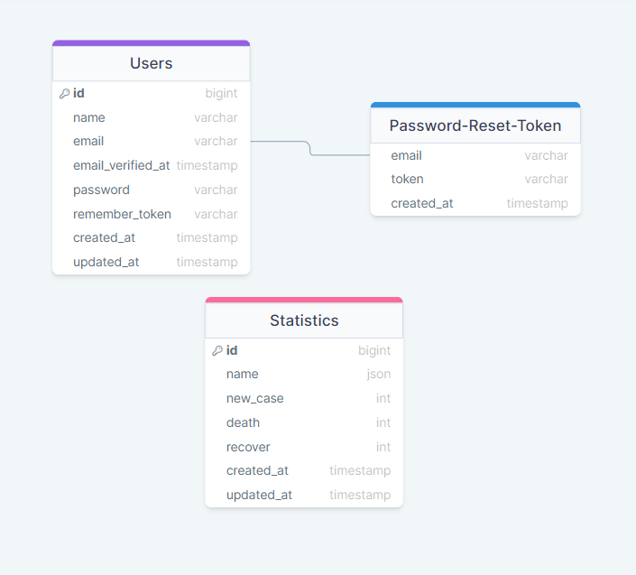

## Coronatime

Coronatime app tracks the number of COVID-19 cases, recovered, and deaths. You can find daily updated statistics about worldwide and also by each country. Data can be sorted in descending and ascending order as well as searched through country name.

Before users can authorize and reach statistic pages, they should be registered and verify their email first.

## Table of Contents

-   <a href="#prerequisites">Prerequisites</a>
-   <a  href="#tech-stack">Tech Stack</a>
-   <a  href="#getting-started">Getting Started</a>
-   <a  href="#migration">Migration</a>
-   <a  href="#running-unit-tests">Running Unit Tests</a>
-   <a  href="#development">Development</a>
-   <a  href="#drawsql-diagram">Resources</a>

---

## Prerequisites

-    PHP@8.2.4 and up
-    MYSQL@8.0.32 and up
-    npm@9.5 and up
-    composer@2 and up

---

## Tech Stack

-   
    <a target="_blank" href="https://laravel.com/docs/10.x/installation">
    Laravel@10.x - back-end framework
    </a>

-   
    <a target="_blank" href="https://github.com/spatie/laravel-translatable">
    Spatie Translatable - package for translation
    </a>

-   
    <a target="_blank" htef="https://redberry.gitbook.io/resources/laravel/php-is-linteri">
    PHP CS Fixer - code formatter
    </a>

-   
    <a target="_blank" htef="https://tailwindcss.com/">
    Tailwind.CSS - for markup design
    </a>

---

## Getting Started

1. First of all you need to clone repository from github:

> git clone https://github.com/RedberryInternship/lika-gvaramashvili-coronatime.git

2. Next step requires you to run composer install in order to install all the dependencies.

> composer install

3. after you have installed all the PHP dependencies, it's time to install all the JS dependencies:

> npm install

and also:

> npm run dev

in order to build your JS/CSS resources.

4. Now we need to set our env file. Go to the root of your project and execute this command.

> cp .env.example .env

And now you should provide .env file all the necessary environment variables:

---

MYSQL:

> DB_CONNECTION=mysql

> DB_HOST=127.0.0.1

> DB_PORT=3306

> DB_DATABASE=\*\*\*

> DB_USERNAME=\*\*\*

> DB_PASSWORD=\*\*\*

---

MAILTRAP:

> MAIL_MAILER=smtp

> MAIL_HOST=sandbox.smtp.mailtrap.io

> MAIL_PORT=2525

> MAIL_USERNAME=\*\*\*

> MAIL_PASSWORD=\*\*\*

> MAIL_ENCRYPTION=tls

> MAIL_FROM_ADDRESS=\*\*\*

> MAIL_FROM_NAME=\*\*\*

---

to generate APP_KEY you can run:

> php artisan key:generate

---

after setting up .env file, execute:

> php artisan config:cache

in order to cache environment variables.

Now, you should be good to go!

---

## Migration

if you've completed getting started section, then migrating database is fairly simple process, just execute:

> php artisan migrate

---

## Running Unit Tests

Running unit tests also is very simple process, just type in following command:

> composer test

## Development

You can run Laravel's built-in development server by executing:

> php artisan serve

and

> npm run dev

---

## Drawsql Diagram

